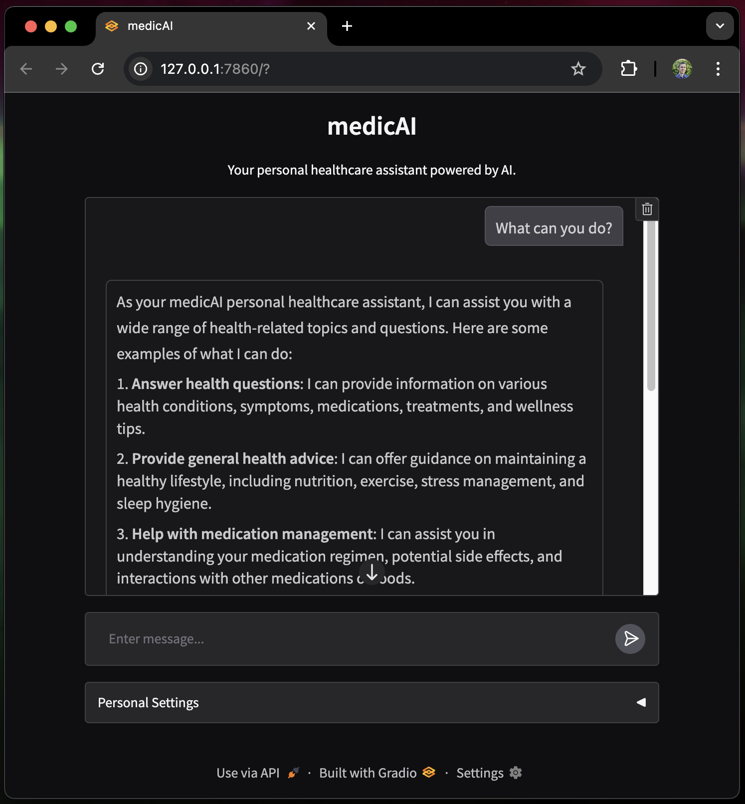

# MedicAI: Your Private AI Health Assistant

MedicAI is a private AI solution designed to assist users with health-related
queries in a secure and personalized manner. It is built to be accessible even
to non-technical users, providing a user-friendly interface for interacting with
a powerful language model.

> **⚠️ MedicAI is not a replacement for qualified medical advice and should only
> be used as a helpful supplement. Always consult a healthcare professional for
> medical concerns. MedicAI should also tell you this as you use it.**



---

## Table of Contents

1. [Core Features](#core-features)
2. [How It Works](#how-it-works)
3. [Prerequisites](#prerequisites)
4. [Usage](#usage)
   - [Optional Personal Settings](#optional-personal-settings)
   - [Advanced Users](#advanced-users)
5. [License](#license)

---

## Core Features

- **Private AI Solution**: All interactions are processed locally, ensuring your
  data remains private.
- **Personalized Responses**: Tailored responses based on user-configured
  personal health information.
- **Accessible to All**: Simple setup and usage, designed for non-technical
  users.

---

## How It Works

MedicAI operates as a two-service system with custom "system" prompts for the
language model (LLM):

1. **Services**:

   - **App Service**: Hosts the user interface and handles chat interactions.
   - **Ollama Service**: Runs the LLM and processes requests.

2. **System Prompts**:
   - A core system prompt is provided to the LLM on first launch to define its
     behavior as medicAI.
   - If the user configures any Personal Settings, all subsequent chat
     interactions will embed the settings so that responses are tailored to the
     user.

---

## Prerequisites

- **Docker**: Install Docker from [docker.com](https://www.docker.com/). For
  most users, [Docker Desktop](https://www.docker.com/products/docker-desktop/)
  is what you should install.

---

## Usage

### Starting the Application

To start MedicAI, clone or download this repository and run the following
command in the project directory:

```bash
docker compose up --build
```

> NOTE: This can take a few minutes to start up the first time you run it. This
> is because Ollama will need to download the LLM (~2GB), which may take some
> time depending on your internet speed. If you attempt to send chat messages
> before Ollama is ready, you will see an Error in the UI. Just be patient and
> wait for Ollama to retrieve the model components!

Once the services are running, open your browser and navigate to
http://localhost:7860 to access the app.

### Stopping the Application

Press `Ctrl+C` in your terminal to stop it.

To also destroy the container resources that were created:

```bash
docker compose down
```

### Optional Personal Settings

For improved response quality, configure the Personal Settings section. This
ensures that all bot responses are tailored to your specific needs.

### Advanced Users

#### Changing Models

To switch the default model, update the entrypoint in the `docker-compose.yaml`
file under the ollama service. For example:

```yaml
entrypoint: /root/health-models/entrypoint.sh llama3.2
```

#### Enabling GPU Support

- Windows/Linux: Follow the Docker GPU support guide to configure GPU usage.
- macOS: Run the services locally instead of using containers (see below).

#### Running without Docker

You can also run this application directly on your hardware. You may want to do
this if you have a GPU that is currently unavailable to Docker (e.g. Apple
Silicon). In this case, you should install and run ollama directly (not in a
container), and you may also need to run the python app directly.

```sh
# Download and install Ollama. Mac: https://ollama.com/download/mac

# Start ollama (skip this if you are running Ollama app with the UI)
ollama serve

# -- In a separate shell --

# Create the custom "health" model from the Modelfile
# This will download the base model (llama3.2 by default)
ollama create health -f ./health-models/Modelfile

# Once the custom model finishes creating, you can start the UI
# Install gradio requirement
pip install -r requirements.txt

# Start the UI
python app.py
```

## License

This project is licensed under the MIT License. See the LICENSE file for
details.
